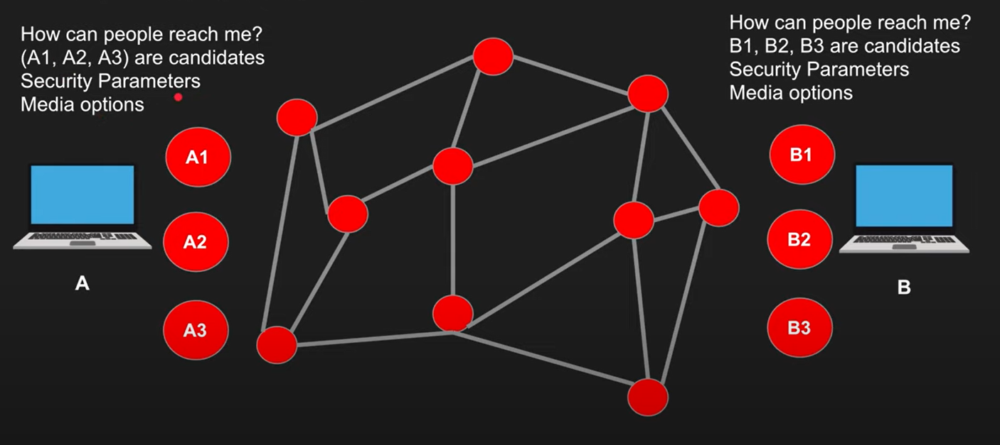
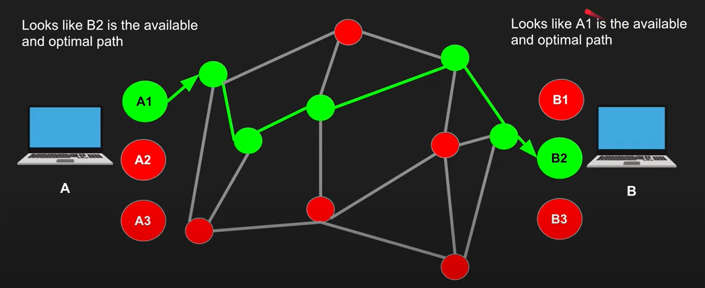
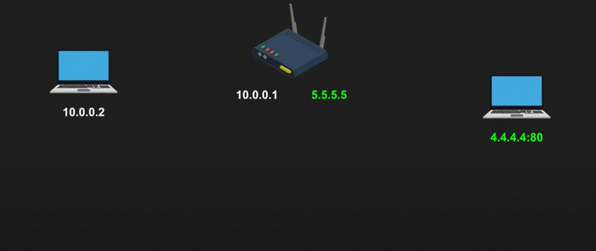
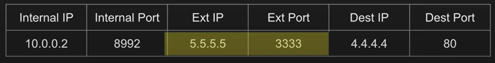
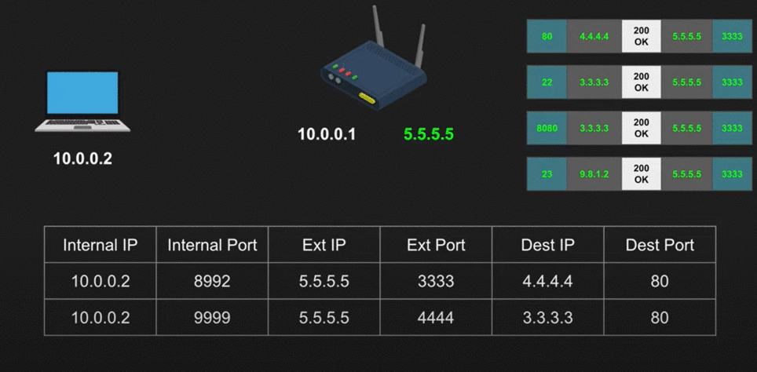

# WebRTC
## Agenda
* WebRTC Overview
* WebRTC Demystified
    * NAT
    * STUN
    * TURN
    * ICE
    * SDP
    * Signaling the SDP
* Demo
* WebRTC Pros & Cons
* Few more thing.....

## Overview
* Stands for Web Real-Time Communication
* Find a peer to peer to exchange video and audio in an efficient and low latency manner
* Standardized API 
* Enables rich communications broswers, mobile, IOT devices
    
### What exactly happens in WebRTC:
   * A wants to connect to B.
   * A finds out all possible ways the public can connect to it.
   * B finds out all possible waus the public can connect to it.
   * A & B signal this session information via other means, like:
        * WhatsApp
        * QR
        * Tweet
        * Websockets
        * HTTP Fetch, etc
   *  A connects to B via the most optimal path.
   * A & B also exchanges their supported media and security.

### Once they find the way:

## WebRTC Demystified
* ## NAT - Network Address Translation

* ## NAT Translations Methods
    * One to One NAT (Full-cone NAT
    * Address restricted NAT
    * Port restricted NAT
    * Symmetric NAT

    #
    ### One to One NAT (Full cone NAT)
    * Packets to external IP:port on the router alwasys maps to internal IP:port without exceptions.

    
    ### Example:
    

